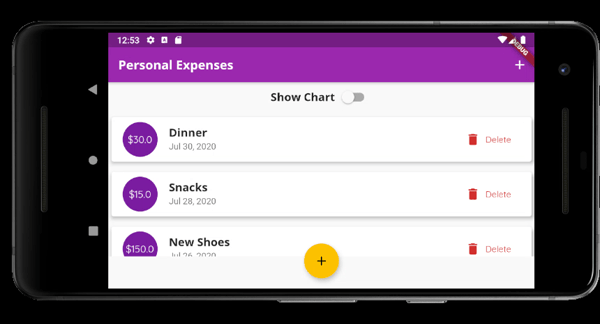

# Personal Expenses Flutter App


---



---

### 📝 About the project
- This project was the result of my first contact with Flutter.
- It's an app that records and shows personal expenses using charts.
- The final result was trully responsive and adaptive app (Android/IOS).

---

### 👨‍💻 Technologies
- [Flutter](https://flutter.dev/)

---

### ▶ How to run this project
- Download this project
- Download [Flutter](https://flutter.dev/docs/get-started/install)


```bash 
# clone this repository to your machine
$ git clone https://github.com/Hildemir/PersonalExpensesApp

# Enter in the project directory
$ cd PersonalExpensesApp/ 

# Run
$ flutter run
 
```


Developed by [Hildemir Regis](https://github.com/Hildemir) 😜